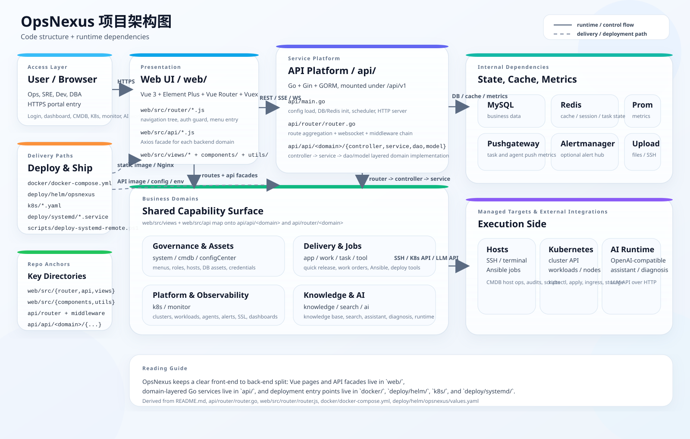

# OpsNexus

OpsNexus 是一个基于 `Go + Vue 3` 构建的智能运维平台，聚合 CMDB、主机纳管、应用发布、Kubernetes、监控告警、审计、知识库与 AI 助手能力，目标是提供统一的运维工作台，而不是单点的堡垒机、CMDB 或发布系统。

## 快速导航

- 想快速了解项目：看 [项目定位](#项目定位) 和 [当前状态](#当前状态)
- 想本地启动开发：看 [快速开始](#快速开始)
- 想在新机器部署 Helm：优先看 [推荐部署路径](#推荐部署路径) 和 [Helm](#helm)
- 想确认当前 Helm 为什么不能直接用默认值：看 [Helm 部署的关键注意事项](#4-helm-部署的关键注意事项)
- 想看生产使用建议：看 [生产说明](#生产说明)

## 项目定位

OpsNexus 当前主要覆盖以下几类运维场景：

- 资产与环境统一纳管
- 发布、任务与变更协同
- Kubernetes 资源治理
- 监控、告警与审计闭环
- 知识沉淀与 AI 辅助诊断

典型能力包括：

| 领域 | 主要能力 |
| --- | --- |
| CMDB / 资产 | 主机纳管、分组管理、数据库资产、SSH 终端、文件上传下载 |
| Kubernetes | 集群、节点、命名空间、工作负载、网络、存储、配置管理 |
| 发布与应用 | 应用列表、环境管理、快速发布、发布治理联动 |
| 任务中心 | 定时任务、脚本任务、Ansible 任务、任务模板 |
| 监控与告警 | 主机监控、数据库监控、SSL 监控、告警事件、告警历史、Webhook 联动 |
| 审计与治理 | 登录日志、操作日志、数据库日志、终端审计、SQL 工单、运维工单 |
| 配置中心 | 通用凭据、主机凭据、密钥管理、LDAP 集成 |
| AI 能力 | AI 助手工作台、AI 诊断分析台、知识检索、巡检模板与巡检报告 |

## 当前状态

截至 `2026-04-08`，当前仓库源码对应的前端品牌已经统一为 `OpsNexus`，登录页、主界面文案与浏览器标题已不再显示历史残留的 `AutoOps` / `devops运维管理系统`。

近期已完成的部署验证：

- `2026-04-07`：Docker Compose 部署方式已完成验证
- `2026-04-08`：Helm 部署方式已完成验证，并确认使用“当前仓库源码构建的镜像”可以正确渲染 `OpsNexus`

需要特别注意：

- [deploy/helm/opsnexus/values.yaml](deploy/helm/opsnexus/values.yaml) 中默认 `web.image.repository` 和 `api.image.repository` 仍指向历史预构建镜像
- 如果直接用默认 `values.yaml` 安装 Helm chart，可能部署出旧的历史界面
- 如果你要部署当前仓库这套源码，建议先构建并推送当前源码镜像，再基于 [deploy/helm/values-current-source.example.yaml](deploy/helm/values-current-source.example.yaml) 生成覆盖文件

## 推荐部署路径

如果你的目标是“在一台新机器上尽快得到和当前验证环境一致的效果”，推荐优先走这条路径：

1. 构建并推送当前仓库源码的 `web` / `api` 镜像。
2. 复制 [deploy/helm/values-current-source.example.yaml](deploy/helm/values-current-source.example.yaml) 为本地覆盖文件。
3. 修改 `web.image.*` 和 `api.image.*` 指向你刚推送的镜像。
4. 执行 `helm upgrade --install ... -f values-current-source.yaml`。
5. 通过 `http://<node-ip>:30080/` 打开系统。

这条路径的默认效果是：

- Web 通过 `NodePort 30080` 暴露
- 浏览器访问 `http://<node-ip>:30080/` 时应跳转到登录页
- 页面标题应为 `OpsNexus`
- `http://<node-ip>:30080/api/v1/captcha` 应返回 `200`

如果你不确定该走 Docker Compose 还是 Helm，可以按下面理解：

- 想快速验证单机运行：优先 Docker Compose
- 想在 Kubernetes / k3s 上长期复用：优先 Helm
- 想得到与本仓库当前共享验证结果最接近的部署形态：优先 Helm + `values-current-source.example.yaml`

## 架构图

下图展示了 OpsNexus 当前仓库对应的主干架构：



- 前端：Vue 3 + Element Plus
- 后端：Go + Gin + GORM
- 核心依赖：MySQL、Redis、Prometheus、Pushgateway、Alertmanager
- 业务域：CMDB、发布、任务、监控、审计、知识、AI
- 外部能力：Kubernetes、主机 / SSH / Ansible、OpenAI-compatible AI Runtime

可编辑源文件：`assets/opsnexus-architecture.drawio`

## 技术栈

### 后端

- Go
- Gin
- GORM
- MySQL
- Redis
- Prometheus / Pushgateway / Alertmanager

### 前端

- Vue 3
- Vue Router
- Vuex
- Element Plus
- ECharts

### 部署形态

- Docker Compose
- Kubernetes manifests
- Helm Chart
- Linux + systemd

## 代码结构

```text
OpsNexus/
├── api/                  # Go 后端
│   ├── api/              # 业务模块（ai / cmdb / k8s / monitor / system / task ...）
│   ├── common/           # 公共配置、工具、结果结构
│   ├── docs/             # Swagger 产物
│   ├── middleware/       # 中间件
│   ├── pkg/              # db / jwt / log / redis 等基础包
│   ├── router/           # 路由注册
│   └── scheduler/        # 调度与后台任务
├── web/                  # Vue 3 前端
│   ├── public/           # HTML 外壳、静态入口
│   ├── src/              # 页面、组件、路由、接口封装
│   ├── tests/            # 前端轻量回归测试
│   └── vue.config.js     # 开发代理与构建配置
├── docker/               # Docker Compose 部署方案
├── deploy/helm/          # Helm Chart
├── deploy/systemd/       # systemd 示例
├── k8s/                  # 原生 Kubernetes manifests
├── scripts/              # 部署与校验脚本
├── docs/                 # 设计、计划、验收记录
└── assets/               # 文档图片等资源
```

## 快速开始

### 环境要求

建议准备以下运行环境：

- `Go 1.24+`
- `Node.js 20+`
- `npm 10+`
- `MySQL 8`
- `Redis 7`

如果你只想快速体验，优先使用 Docker Compose 或 Helm，无需本地手动安装所有依赖。

### 本地开发

#### 1. 启动后端

```bash
cd api
go test ./...
go run main.go -c ./config.yaml
```

默认后端监听配置来自 `api/config.yaml`。

#### 2. 启动前端

```bash
cd web
npm ci
npm test
npm run serve
```

前端开发代理见 `web/vue.config.js`。如果你不使用仓库中的默认 API 目标地址，可以通过环境变量覆盖：

```bash
VUE_APP_API_PROXY_TARGET=http://127.0.0.1:8000 npm run serve
```

#### 3. 构建前端

```bash
cd web
npm run build
```

## AI 能力

当前仓库内已接入 AI 相关能力，包括：

- `AI 助手工作台`：面向主机、告警、工单、发布等场景的统一对话入口
- `AI 诊断分析台`：按场景组装知识、上下文与诊断结果
- `巡检模板 / 巡检报告`：支持模板中心、报告归档与历史复盘
- `实时模型链路`：支持 OpenAI-compatible 模型接入

截至 `2026-04-07`，共享验证环境中的 AI 助手链路已恢复为可用状态，运行态展示为 `ready`，且实际助手调用已验证 `usedLlm=true`。

## 部署方式

### Docker Compose

适合单机快速体验、接口联调或最小化环境验证。

```bash
cd docker
docker compose up -d --build
```

如果需要把 AlertManager 一起拉起：

```bash
cd docker
docker compose --profile p1-alerting up -d --build
```

说明：

- 当前 `docker/docker-compose.yml` 已默认从当前仓库源码构建 `devops-api` 与 `devops-web`
- 这条路径适合验证“当前源码是否能完整启动”
- 详细参数说明见 [docker/README.md](docker/README.md)

建议至少执行以下烟雾验证：

```bash
curl -I http://<host>:<WEB_PORT>/
curl http://<host>:<WEB_PORT>/api/v1/captcha
```

### Helm

适合 Kubernetes 环境，也适合后续做标准化发布与回滚。

Chart 目录：

```text
deploy/helm/opsnexus
```

基础安装命令：

```bash
helm upgrade --install opsnexus ./deploy/helm/opsnexus \
  -n opsnexus \
  --create-namespace
```

但是，如果你的目标是部署“当前仓库源码”，推荐使用下面这套流程。

#### Helm 前提

在开始前，建议先确认：

- 集群已经可用，例如 `kubectl get nodes` 正常
- Helm 已安装，例如 `helm version` 正常
- 集群节点可以拉取你构建后的镜像，或者你已经把镜像导入到集群运行时
- 你已经准备好数据库、Redis，以及它们对应的接入方式

#### 1. 先构建并推送当前源码镜像

以下命令需要在仓库根目录执行：

```bash
docker build -f docker/web/Dockerfile -t <registry>/opsnexus-web:<tag> .
docker build -f docker/api/Dockerfile -t <registry>/opsnexus-api:<tag> .
docker push <registry>/opsnexus-web:<tag>
docker push <registry>/opsnexus-api:<tag>
```

#### 2. 基于示例文件准备覆盖值文件

先复制仓库自带的当前源码示例文件：

```bash
cp deploy/helm/values-current-source.example.yaml values-current-source.yaml
```

然后至少修改以下字段：

- `web.image.repository`
- `web.image.tag`
- `api.image.repository`
- `api.image.tag`

如果新机器需要直接暴露服务，也可以把：

- `web.service.type`
- `api.service.type`

从 `ClusterIP` 改成 `NodePort`。

说明：

- 当前仓库已支持显式 `web.service.nodePort` / `api.service.nodePort`
- 仓库自带的 [deploy/helm/values-current-source.example.yaml](deploy/helm/values-current-source.example.yaml) 已默认把 Web NodePort 固定为 `30080`
- 如果你还想把 API 也暴露出来，可以额外把 `api.service.type` 改成 `NodePort`，再指定例如 `api.service.nodePort: 30081`
- 示例文件里也保留了外置 MySQL / Redis 的注释示例，新机器接外部依赖时可以直接打开使用

#### Helm 下大模型配置放在哪里

Helm 部署时，大模型相关参数目前不是单独的 `ai:` 配置段，而是放在你本地的 `values-current-source.yaml` 里，通过 `api.extraEnv` 注入给后端容器。

可以直接在 `values-current-source.yaml` 里补上：

```yaml
api:
  extraEnv:
    - name: AI_ENABLED
      value: "true"
    - name: AI_PROVIDER
      value: "openai"
    - name: AI_BASE_URL
      value: "https://api.openai.com/v1"
    - name: AI_API_KEY
      value: "sk-xxxx"
    - name: AI_MODEL
      value: "gpt-5.4"
    - name: AI_REASONING_EFFORT
      value: "high"
    - name: AI_TIMEOUT_SECONDS
      value: "60"
```

说明：

- 这部分配置写在你复制出来的本地覆盖文件 `values-current-source.yaml` 中，不建议直接改仓库里的示例文件
- `AI_API_KEY` 属于敏感信息，建议只保留在本地部署文件里，避免提交到仓库
- 后端实际读取的是这些 `AI_*` 环境变量；当前 chart 生成的 `/app/config.yaml` 还没有单独模板化 `ai:` 配置段
- 如果只想先验证 Helm 链路是否打通，最少需要确认 `AI_ENABLED=true`、`AI_API_KEY`、`AI_MODEL` 这几项已经配置

#### 3. 安装并验证

```bash
helm lint ./deploy/helm/opsnexus
helm template opsnexus ./deploy/helm/opsnexus > /tmp/opsnexus.yaml

helm upgrade --install opsnexus ./deploy/helm/opsnexus \
  -n opsnexus \
  --create-namespace \
  -f values-current-source.yaml

helm test opsnexus -n opsnexus --timeout 10m
kubectl -n opsnexus get pods
```

如果你直接使用仓库示例文件里的默认 Web 暴露方式，还可以继续验证：

```bash
curl -I http://<node-ip>:30080/
curl http://<node-ip>:30080/api/v1/captcha
```

预期结果：

- `http://<node-ip>:30080/` 能打开登录页
- 浏览器标题是 `OpsNexus`
- `captcha` 接口返回 `200`
- `helm test` 成功

如需本地查看服务：

```bash
kubectl -n opsnexus port-forward svc/opsnexus-web 8080:80
kubectl -n opsnexus port-forward svc/opsnexus-api 8000:8000
```

再验证：

```bash
curl http://127.0.0.1:8000/api/v1/captcha
```

#### 4. Helm 部署的关键注意事项

- 当前 [deploy/helm/opsnexus/values.yaml](deploy/helm/opsnexus/values.yaml) 默认镜像仍是历史 `deviops-*` 镜像
- 这不代表 chart 不可用，而是说明“默认镜像源”与“当前源码主线”已经脱钩
- 因此，验证 Helm 是否能部署当前 OpsNexus，应该看“用当前源码镜像覆盖后的部署结果”，而不是只看默认镜像是否能拉起
- 下次在新机器部署时，优先从 [deploy/helm/values-current-source.example.yaml](deploy/helm/values-current-source.example.yaml) 复制出一份本地覆盖文件
- 详细 Helm 文档见 [deploy/helm/README.md](deploy/helm/README.md)

### systemd / 宿主机二进制

仓库提供了 systemd 示例：

- [deploy/systemd/opsnexus-api.service](deploy/systemd/opsnexus-api.service)
- [deploy/systemd/opsnexus-api.config.yaml.example](deploy/systemd/opsnexus-api.config.yaml.example)
- [deploy/systemd/opsnexus-api.env.example](deploy/systemd/opsnexus-api.env.example)
- [scripts/deploy-systemd-remote.ps1](scripts/deploy-systemd-remote.ps1)

适合将后端二进制与 Nginx 或 Docker 化前端组合部署到 Linux 宿主机。

注意：

- 这里的 `8000` 默认是后端 API 端口，不是前端页面入口
- 直接访问 `http://<host>:8000/` 时，当前后端会返回 `404 page not found`
- API 烟雾验证应使用 `http://<host>:8000/api/v1/captcha`
- 如果你希望浏览器直接打开 OpsNexus 页面，还需要额外部署前端静态资源，并通过 Nginx 或其他 Web 服务器对外提供入口
- 当前仓库已提供远端 Nginx 示例配置 [opsnexus-remote-nginx.conf](opsnexus-remote-nginx.conf)，默认监听 `8080`

最小前提：

- Linux 宿主机已提供 `systemd`
- 你已经准备好 MySQL / Redis，既可以是外置服务，也可以是本机容器
- 如果宿主机存在名为 `opsnexus-mysql` / `opsnexus-redis` 的 Docker 容器，unit 会在启动前尝试自动拉起它们
- 如果你使用外置 MySQL / Redis，当前 unit 不再强依赖 `docker.service`

推荐约定：

- 运行目录：`/opt/opsnexus-remote-test`
- 配置模板：`/opt/opsnexus-remote-test/config.yaml.example`
- 实际配置：`/opt/opsnexus-remote-test/config.yaml`
- 密钥环境文件：`/etc/opsnexus/opsnexus-api.env`

其中：

- `config.yaml` 放非敏感默认配置
- `opsnexus-api.env` 放数据库密码、Redis 密码、Webhook Token、AI_API_KEY 等敏感信息
- systemd 通过 `EnvironmentFile` 注入环境变量，后端再通过环境变量覆盖 YAML 配置
- [scripts/deploy-systemd-remote.ps1](scripts/deploy-systemd-remote.ps1) 默认沿用本机 `ssh` / `scp`，如果目标机只有密码可登录，也可以直接传 `-Password`

一个可直接执行的远程部署示例：

```powershell
powershell -ExecutionPolicy Bypass -File .\scripts\deploy-systemd-remote.ps1 `
  -RemoteHost <host> `
  -User root `
  -Password <password> `
  -UploadExamples
```

如果你还想把前端静态资源和 `nginx:8080` 一起部署出来，可以直接执行：

```powershell
powershell -ExecutionPolicy Bypass -File .\scripts\deploy-systemd-remote.ps1 `
  -RemoteHost <host> `
  -User root `
  -Password <password> `
  -IncludeWeb `
  -ConfigureNginx `
  -UploadExamples
```

这条命令会做三件事：

- 上传后端二进制并刷新 `opsnexus-api.service`
- 上传 `web/dist`
- 安装并配置 `nginx`，让 `http://<host>:8080/` 成为前端入口，同时把 `/api/` 反向代理到本机 `8000`

部署后至少验证：

```bash
systemctl is-enabled opsnexus-api.service
systemctl is-active opsnexus-api.service
curl http://127.0.0.1:8000/api/v1/captcha
```

如果带了 `-IncludeWeb -ConfigureNginx`，还应额外验证：

```bash
systemctl is-enabled nginx
systemctl is-active nginx
curl http://127.0.0.1:8080/
curl http://127.0.0.1:8080/api/v1/captcha
```

## 已验证记录

当前仓库至少已经完成过以下部署回归：

| 日期 | 方式 | 结论 |
| --- | --- | --- |
| 2026-04-07 | Docker Compose | 已验证可以从当前源码构建并启动 |
| 2026-04-08 | Helm + k3s | 已验证 Helm chart 可部署当前源码镜像，并通过 `helm test` |
| 2026-04-08 | systemd + 宿主机二进制 | 已在 `10.0.0.203`（Ubuntu 22.04.1）验证：服务 `enabled + active`，`/api/v1/captcha` 返回 `200` |
| 2026-04-08 | systemd + nginx 8080 前端入口 | 已在 `10.0.0.203` 验证：`http://10.0.0.203:8080/` 返回 OpsNexus 前端，`http://10.0.0.203:8080/api/v1/captcha` 返回 `200` |

Helm 路径的验证重点是：

- 前端实际渲染为 `OpsNexus`
- API `captcha` 接口返回 `200`
- `helm test` 烟雾测试成功
- 当前源码示例值文件默认 Web 入口为 `NodePort 30080`

本次 systemd 路径的实测事实：

- 验证主机：`10.0.0.203`
- 操作系统：`Ubuntu 22.04.1 LTS`
- 依赖方式：宿主机 `systemd` + 本机 Docker 容器化 MySQL / Redis
- 镜像来源：目标机直连 Docker Hub 失败时，可直接复用仓库模板里的阿里云镜像源
- 服务状态：`systemctl is-enabled opsnexus-api.service -> enabled`
- 运行状态：`systemctl is-active opsnexus-api.service -> active`
- 烟雾验证：`curl http://127.0.0.1:8000/api/v1/captcha` 返回业务 `code=200`
- 前端入口：`http://10.0.0.203:8080/`
- 前端代理验证：`GET http://10.0.0.203:8080/api/v1/captcha -> 200`
- Nginx 状态：`systemctl is-enabled nginx -> enabled`，`systemctl is-active nginx -> active`

## 生产说明

当前仓库已经具备较完整的功能面，但如果要用于正式生产环境，仍建议先完成一轮安全与部署治理收口，包括但不限于：

- 密钥与凭据治理
- 配置分层与环境变量注入
- 调试开关与对外暴露面收口
- 默认账号 / 示例数据清理
- 部署目录、权限与回滚策略规范化
- 镜像仓库、Tag 策略与回滚规范统一

如果你准备把仓库上传到 GitHub，请至少确认以下几点：

- 不要提交任何真实 `.env`、浏览器态文件、远端导出的 `config.yaml`
- 仓库内保留的配置文件应当是模板值或占位符
- 真实敏感值请仅保留在远端环境变量文件、Secret 或本地未追踪文件中

相关计划可参考：

- [docs/superpowers/plans/2026-04-07-opsnexus-production-readiness.md](docs/superpowers/plans/2026-04-07-opsnexus-production-readiness.md)

## 路线图

后续方向包括：

- Windows 资产与远程运维能力
- 更完整的 KEDA / VPA / 自动扩缩容闭环
- 更细粒度的发布编排与多集群治理
- 更成熟的 AI Agent 编排与知识沉淀流程

## 相关文档

- [docker/README.md](docker/README.md)
- [deploy/helm/README.md](deploy/helm/README.md)
- [docs/2026-03-20.txt](docs/2026-03-20.txt)
- [DESIGN.md](DESIGN.md)

## 参考项目

- KubePolaris
- Nightingale
- JumpServer
- Argo CD
- AutoOps
